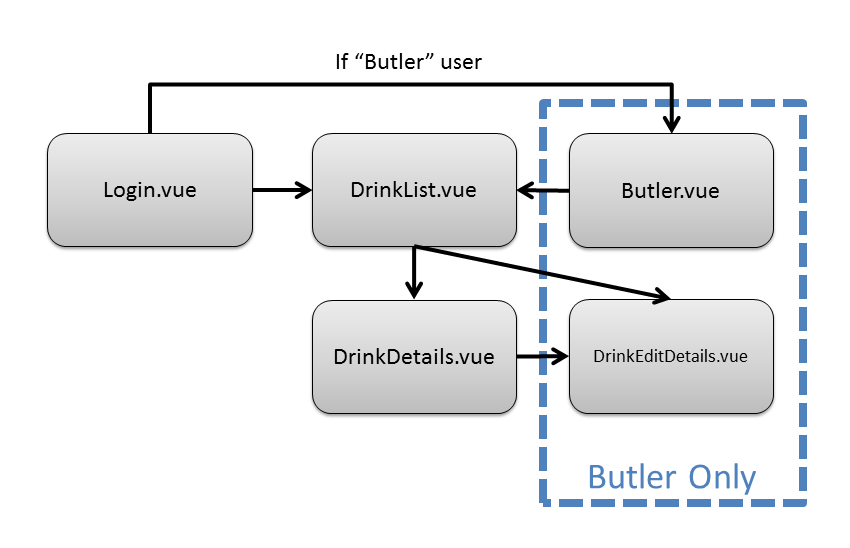
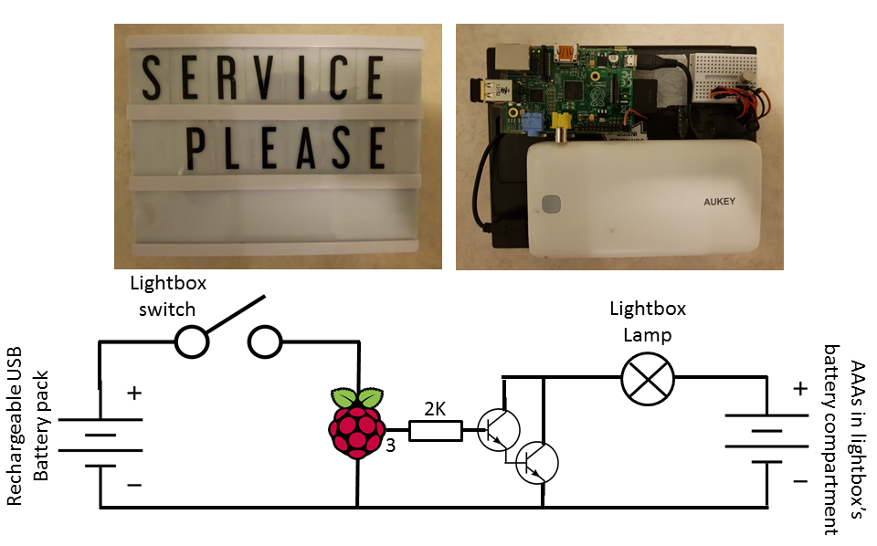

# Christmas Bar

At Christmas we have a full house, with lots of family visiting. I like to have a well stocked bar so I made this application to keep track of drinks orders and stock levels. The main front-end is a Vue.js web-app which also has a manifest to allow it to be installed as a stand-alone application on a smart-phone or tablet. In addition there is an alexa skill to allow ordering by voice and a physical notifier that lights up when there are active orders.

The Butler super-user can't order drinks but can add new drinks, edit existing drinks and tweak stock levels. I kept a tablet in the kitchen logged in as the Butler for this purpose, the dedicated butler screen it showed was a live display of current orders with the ability to cancel or acknowledge them.

## Architecture

The main front-end is a Vue.js web-app styled with Bootstrap. Communication between the front-end and back-end is done through socket.io which allows instant notification of changes between devices. The data is stored in S3 as are the product images which are served direct from the S3 bucket.

The back-end is implemented in Python and flask and hosted on EC2. The back-end only does http so the https is handled by the elastic load balancer.


## Web front-end

The Vue.js front-end uses the Vue router to switch between pages. Each page is a self contained component. Common functionality between pages such as the header bar and the "drink" button are spun out into a separate component to allow easy reuse.



The EditDrinkDetails page makes use of specialist components to allow the capturing of product images using in-device camera(s) or by uploading files. The images are scaled in the client before upload.

## Physical Notifier

The notifier is made from a lightbox, a raspberry pi and few electronic components. To make it portable it has a rechargeable USB battery pack to power the pi.

On the pi script [notifier.py](notifier.py) starts at bootup and listens on the socket.io socket used for communication in the webapp. If there is currently an order then GPIO2 (pin 3) is set high and the lightbox is lit up.



## Alexa integration

The Alexa skill allows family members to order drinks by saying something like "Alexa ask Butler to fetch a gin for Grandpappy". Not all drinks are supported, only the more standard ones. Synonymns are supported for both family members and drinks. Both a person and a drink is required to complete the intent and Alexa will prompt for any missing information.


## Build and Run

``` bash
# install dependencies
npm install

# serve with hot reload at http://0.0.0.0:8080
npm run dev

# build for production with minification
npm run build

# docker build
sudo docker-compose build

# docker run
sudo docker-compose up -d
```
